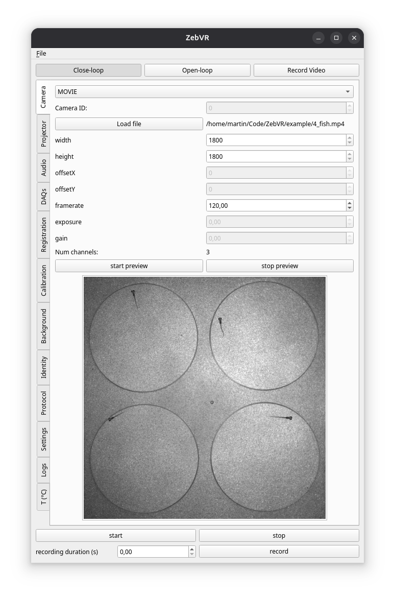

# ZebVR

Virtual reality for zebrafish.

<!---TODO
Add screenshots of the GUI
-->

## System requirements

This program has been tested on Ubuntu 24.04 with X11 (no Wayland support yet).
It should also run on Windows 10/11 but hasn't been extensively tested, and full
installation instructions on Windows are not listed here.
We recommend using a modern multicore machine with at least 32GB of RAM.
Parts of the installation process require sudo rights.

## Extra Hardware (optional)

- ViewSonic X2-4K projector
- Thorlabs PM100D
- Thorlabs CCS100
- Ximea camera 

For a full list of hardware used for the VR setup, see doc/BOM/bom.md

## Software dependencies

### deb packages on Ubuntu

```bash
sudo apt-get install libportaudio2 build-essential libusb-1.0-0-dev 
```

### Labjack exodriver

On Ubuntu:
```bash
git clone https://github.com/labjack/exodriver.git
cd exodriver/
sudo ./install.sh
cd .. 
rm -rf exodriver
```

Windows: https://files.labjack.com/installers/LJM/Windows/x86_64/release/LabJack_2024-05-16.exe

## Installation instructions

Solving the environment might take a few minutes.

```bash
git clone https://github.com/ElTinmar/ZebVR.git
cd ZebVR
conda env create -f ZebVR3.yml
conda activate ZebVR3
```

A full list of dependencies with version number can be found in requirements.txt

### Install camera SDK and python bindings into environment

The SDK and python binding URLs are hardcoded in the script and will break
if the camera manufacturers decide to change their website layout. The SDK 
can be manually downloaded from the manufacturer website, and the python module placed
in the conda environment site-packages folder (e.g. /home/user/miniconda3/envs/ZebVR3/lib/python3.13/site-packages/ximea)

```bash
conda activate ZebVR3
python scripts/setup_ximea.py
python scripts/setup_spinnaker.py
```

You can also install the SDK (requires sudo) or python bindings separately:

```bash
python scripts/setup_ximea.py --only-sdk
python scripts/setup_spinnaker.py --only-sdk
```

```bash
conda activate ZebVR3
python scripts/setup_ximea.py --only-python
python scripts/setup_spinnaker.py --only-python
```

Please note that every time a new kernel is installed during a system update,
the SDK needs to be reinstalled.

### Thorlabs hardware 

This is needed to communicate with Thorlabs spectrophotometer and power measurement unit 
for automated power measurements.

```bash
sudo apt install innoextract
python -m thorlabs_ccs.get_firmware
```

set udev rule for all Thorlabs devices:

```bash
sudo tee /etc/udev/rules.d/99-thorlabs.rules > /dev/null << 'EOF'
SUBSYSTEMS=="usb", ATTRS{idVendor}=="1313", GROUP="plugdev", MODE="0666"
EOF
```

Reload udev rules:

```bash
sudo udevadm control --reload-rules
sudo udevadm trigger
```

### Permissions to access hardware

```bash
sudo usermod -a -G plugdev,dialout "$USER"
```

## Running the software 

```bash
conda activate ZebVR3
python -m ZebVR
```

## Demo

This is virtual reality program and is meant to be run with a camera input.
However, for demonstration/testing purposes, the program can be run using a video file as input:


In the camera tab, select `MOVIE` in the dropdown menu, then click on `Load file`
An example movie is provided in `example/4_fish.mp4`

## Instructions for use




Select a mode:

- Close-loop: animals are tracked, the stimulus can react to fish actions in real time.
- Open-loop: no live tracking, stimulation still possible 
- Record Video: only record behavior, no stimulation


The system is configured by moving down the tabs, in order:

- Camera: Select a camera and set relevant parameters (exposure, resolution. framerate, ...). Live preview
- Projector: Select a monitor for output. Setup ViewSonic projector parameters. Run power calibration.
- Audio (optional): Select audio output and audio stream parameters.
- DAQs (optional): Select connected DAQ devices (Arduino running pyfirmata, Labjack, NI card)
- Registration: Compute transformation between camera space and screen space.
- Calibration: Calibrate camera (px/mm)
- Background: Get an image of the background, used for attributing identities, and background subtraction during live tracking
- Identity: Set a grid identify animals.
- Protocol (optional): prepare a stimulation protocol 
- Settings: enable/configure video recording. Set experiment metadata / configuration file location.
- Logs (optional): used for debugging only
- T (C) (optional): setup a temperature probe via serial port

In order to run a pre-specified protocol (setup in the Protocol tab), set a `recording duration` and hit `record`.
To specify stimulations manually on the fly, press `start` instead.
The`stop` button will stop any running experiment.

A full manual is not written yet but will be added once all features are stable. 

## Troubleshooting

### PCIe Camera No LED 

Make sure the power switch on the PCIe adapapter board is on 24V

### Ximea Error 57

if error 57 device already open, or if program is slower than usual

```bash
sudo killall python
```

### Ximea Error 56

if error 56 No Devices Found, reinstall SDK (requires sudo)

```bash
python scripts/setup_ximea.py --only-sdk
```

### libtiff.so.5: cannot open shared object file

```
sudo apt install libtiff6
cd /usr/lib/x86_64-linux-gnu/
sudo ln -s libtiff.so.6 libtiff.so.5
```

### modprobe: ERROR: could not insert 'ximea_cam_pcie': Key was rejected by service

Disable secure boot in the BIOS

### module not found

Try refreshing the environment

```
conda env update -f ZebVR3.yml
```