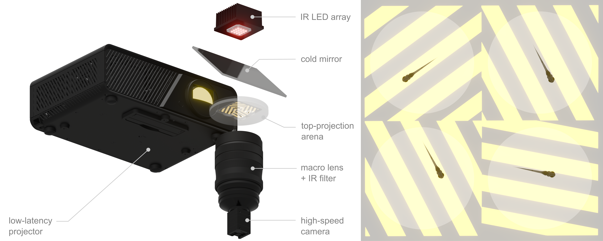
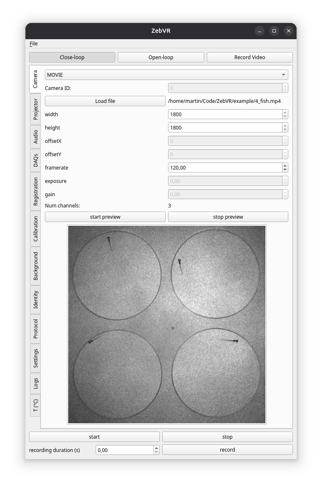

# ZebVR

Virtual reality for zebrafish.

<!---TODO
Add screenshots of the GUI
-->




## System requirements

This program has been tested on Ubuntu 22.04/24.04. It should run on debian-based 
distributions (apt package manager, systemd).
It should also run on Windows 10/11 but hasn't been extensively tested, and full
installation instructions on Windows are not listed here.
We recommend using a modern multicore machine with at least 32GB of RAM.
Parts of the installation process require sudo rights.
Ximea PCIe camera require Secure boot to be disabled

## Simple installation procedure on Ubuntu

```
sudo apt install git
git clone https://github.com/ElTinmar/ZebVR.git
cd ZebVR
./install.sh
```
Then reboot the computer.

Run the program with:
```
./run.sh
```

## Extra Hardware (optional)

- ViewSonic X2-4K projector
- Thorlabs PM100D
- Thorlabs CCS100
- Ximea camera 

For a full list of hardware used for the VR setup, see doc/BOM/bom.md


## Demo

This is virtual reality program and is meant to be run with a camera input.
However, for demonstration/testing purposes, the program can be run using a video file as input:


In the camera tab, select `MOVIE` in the dropdown menu, then click on `Load file`
An example movie is provided in `example/4_fish.mp4`.

## Instructions for use




Select a mode:

- Close-loop: animals are tracked, the stimulus can react to fish actions in real time.
- Open-loop: no live tracking, stimulation still possible 
- Record Video: only record behavior, no stimulation


The system is configured by moving down the tabs, in order:

- Camera: Select a camera and set relevant parameters (exposure, resolution. framerate, ...). Live preview
- Projector: Select a monitor for output. Setup ViewSonic projector parameters. Run power calibration.
- Audio (optional): Select audio output and audio stream parameters.
- DAQs (optional): Select connected DAQ devices (Arduino running pyfirmata, Labjack, NI card)
- Registration: Compute transformation between camera space and screen space.
- Calibration: Calibrate camera (px/mm)
- Background: Get an image of the background, used for attributing identities, and background subtraction during live tracking
- Identity: Set a grid identify animals.
- Protocol (optional): prepare a stimulation protocol 
- Settings: enable/configure video recording. Set experiment metadata / configuration file location.
- Logs (optional): used for debugging only
- T (C) (optional): setup a temperature probe via serial port

In order to run a pre-specified protocol (setup in the Protocol tab), set a `recording duration` and hit `record`.
To specify stimulations manually on the fly, press `start` instead.
The`stop` button will stop any running experiment.

A full manual is not written yet but will be added once all features are stable. 

## Missing features

- Audio calibration
- Specify visual stimuli with irradiance units (provide a choice between floating points vs calibrated irradiance units)
- Head-embedded VR
- 3D environments
- better Windows installation

## Troubleshooting

### PCIe Camera No LED 

Make sure the power switch on the PCIe adapapter board is on 24V

### Ximea Error 57

if error 57 device already open, or if program is slower than usual

```bash
sudo killall python
```

### Ximea Error 56

if error 56 No Devices Found, reinstall SDK (requires sudo)

```bash
python scripts/setup_ximea.py --only-sdk
```

### libtiff.so.5: cannot open shared object file

```
sudo apt install libtiff6
cd /usr/lib/x86_64-linux-gnu/
sudo ln -s libtiff.so.6 libtiff.so.5
```

### modprobe: ERROR: could not insert 'ximea_cam_pcie': Key was rejected by service

Disable secure boot in the BIOS

### module not found

Try refreshing the environment

```
conda env update -f ZebVR.yml
```