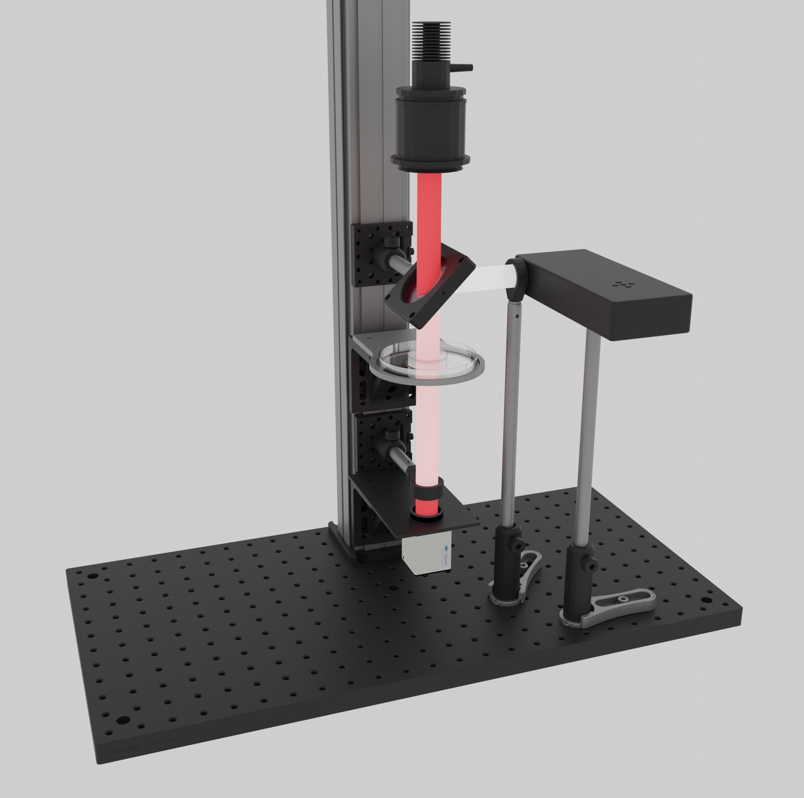

# Mechanical design of the virtual reality setup

## Components

* projector: Texas Instrument DLP Lightcrafter 4500
* High speed camera: Ximea MX042RG-CM-X2G2-FF 
* Infrared light
* Cold mirror
* IR filter
* Misc. Thorlabs parts

