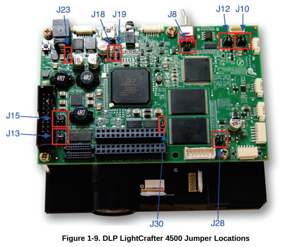

# Setting up the lightcrafter to display at 120 Hz

The EDID is programmed at the factory with resolutions of 1280 x 800 and 912 x 1140 at 60 Hz.
To make the display available at 120 Hz, it is recommended to update the EDID on the device.

## 1. Set the J8 jumper to enable writing to EDID EEPROM



Source: https://www.ti.com/lit/ug/dlpu011f/dlpu011f.pdf

## 2. Install programms to read and write the EEPROM via I2C through the HDMI cable

```
sudo apt install ghex
sudo apt install read-edid
sudo apt install i2c-tools
```

## 3. Make a backup of the original EDID

Plug the HDMI cable in the Lightcrafter and your machine. The EEPROM can be accessed 
even if the Lightcrafter is turned off.

### 3.1 Identify on which I2C bus the Lightcrafter is

List all the I2C buses:

```
i2cdetect -l
```

If necessary try to access EDID for each detected device using 

```
sudo get-edid -b X | parse-edid 
```

replace X by the bus number identified earlier, in my case it was

```
sudo get-edid -b 2 | parse-edid 
```

### 3.1 Dump EDID to a file

Once you have found the right bus, save the EDID to a file

```
sudo get-edid -b 2 > original.bin 
``` 

You can check and modify the content of the file using an hexadecimal editor such as ghex.

## 4. Modify the EDID to advertize 912 x 1140 at 120 Hz

The VESA EDID 1.3 specification can be downloaded from here https://vesa.org/vesa-standards/ 
and details the organization of the 256 bytes. This is a useful resource should you 
wish to implement other resolutions (especially the "Detailed Timing Descriptor" section).

## 4.1 Required timings


Source: https://e2e.ti.com/support/dlp-products-group/dlp/f/dlp-products-forum/699749/dlplcr4500evm-120hz-output-in-video-mode-is-choppy

## 4.2 Flashing the EEPROM

Be EXTREMELY careful when you flash the device, if you select the wrong I2C bus you
could permanently damage your computer. Do at your own risk. You have been warned.
I mean seriously.

```
sudo i2cset 2 0x50 0x5A 0x08 b # Pixel Clock first 8 bits | 146MHz -> 14600 -> 0x39 0x08
sudo i2cset 2 0x50 0x5B 0x39 b # Pixel Clock last 8 bits
sudo i2cset 2 0x50 0x5C 0x90 b # Horizontal active lower 8 bits | 912
sudo i2cset 2 0x50 0x5D 0x80 b # Horizontal blanking lower 8 bits | 128
sudo i2cset 2 0x50 0x5E 0x30 b # Horizontal active upper 4 bits, Horizontal blanking upper 4 bits
sudo i2cset 2 0x50 0x5F 0x74 b # Vertical active lower 8 bits | 1140
sudo i2cset 2 0x50 0x60 0x1E b # Vertical blanking lower 8 bits | 30
sudo i2cset 2 0x50 0x61 0x40 b # Vertical active upper 4 bits, Vertical blanking upper 4 bits
sudo i2cset 2 0x50 0x62 0x0A b # Horizontal Sync Offset (Back porch), lower 8 bits | 10
sudo i2cset 2 0x50 0x63 0x40 b # Horizontal Sync pulse width, lower 8 bits | 64
sudo i2cset 2 0x50 0x64 0x3A b # Vertical Sync Offset (Back porch) lower 4 bits, Vertical Sync pulse width lower 4 bits | 3, 10
sudo i2cset 2 0x50 0x65 0x00 b # bit 7,6: Horizontal Sync Offset upper 2 bits, bit 5,4: Horizontal Sync pulse width upper 2 bits, bits 3,2: Vertical Sync Offset upper 2 bits, bits 1,0: Vertical Sync pulse width upper 2 bits
sudo i2cset 2 0x50 0x66 0x1C b # Horizontal Image Size (mm), lower 8 bits | 284
sudo i2cset 2 0x50 0x67 0xD5 b # Vertical Image Size (mm), lower 8 bits | 213
sudo i2cset 2 0x50 0x68 0x10 b # Horizontal Image Size upper 4 bits, Vertical Image Size upper 4 bits
sudo i2cset 2 0x50 0x69 0x00 b # Horizontal border | 0
sudo i2cset 2 0x50 0x6A 0x00 b # Vertical border | 0
sudo i2cset 2 0x50 0x6B 0x1E b # Flags
sudo i2cset 2 0x50 0x7F 0x55 b # Checksum
```

Check that the flash was successful:

```
sudo get-edid -b 2 | parse-edid 
```

You should now be able to see the line:

```
Modeline     "Mode 2" 146.00 912 922 986 1040 1140 1143 1153 1170 +hsync +vsync
```

This procedure can be adapted to add other resolutions, a good understanding 
of the EDID specification will be necessary.

You should now be able to select 912 x 1140 at 120 Hz in the display 
settings when you plug in the Lightcrafter to a (relatively recent) computer.

# 5. Use the DLP Lightcrafter Pattern mode

For some reason, the 120 Hz display rate doesn't seem to work in video mode 
(the Lightcrafter reports a buffer freeze and the image is very choppy), contrary
to what is advertised in the documentation.
It does work in 8-bit pattern mode with input from the HDMI and triggers on VSYNC
however, so be sure to select that mode, and dial in an exposure of 8333 or less
(maximum duration of a frame at 120 Hz).